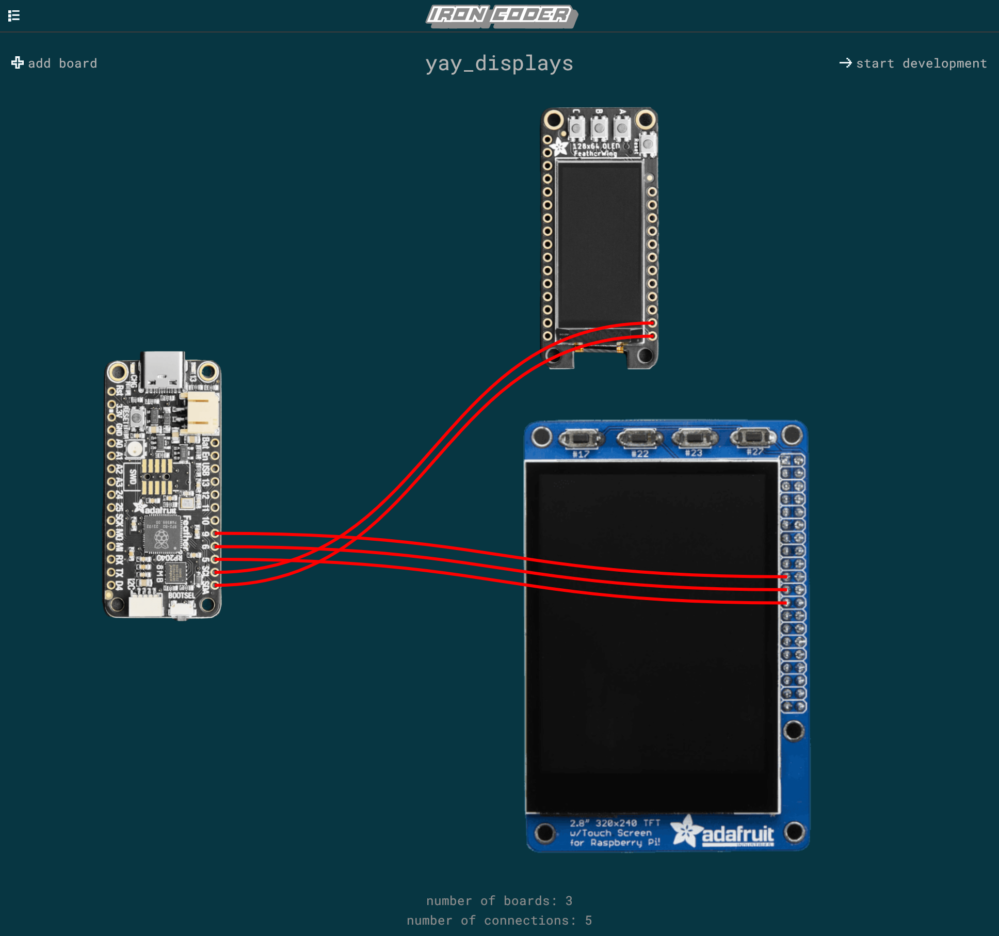

# Iron Coder
An embedded Rust IDE with an emphasis on a fun and insightful coding experience

#### By Carsten Thue-Bludworth, 2023

## Prototype Features (as of June 13th, 2023)
The application is currently in prototype phase, with the following features implemented:
* Overall GUI functionality with persistent state:
  * Fonts are configurable in source code
  * Protoype of app settings window, currently able to change colorscheme
  * Icons are incorporated
  * Two main "modes" -- one for creating a new project (selecting a board), and another for working on a currently active project.
* Text editor:
  * Syntax highlighting with `syntect` crate
  * Backend can load and save code from/to file
  * Editor actions include building code with `cargo` and the `std::process` module
* Spec Viewer:
  * A `Board` struct defines the aspects of each supported board, which is loadable from a `toml` description.
  * A file hierarchy describes each board, and a subdirectory contains example projects for that board.
  * The `egui::widgets::Widget` trait is implemented to display the spec viewer in the app.

## Concept
Rust is a powerful and growing programming language. With a focus on safety and performance, it is an evolution in the ecosystem of systems programming. This project has a few inspirations and goals:
* Help me learn and hone skills in developing a professional application in Rust
* Serve as a playground to experiment with the hardware-software interface
* Set a foundation for benchmarking and analyzing the performance of hardware-software systems
* Engage newcomers to Rust and/or embedded development, and build a community similar to Arduino

## Project Structure
This repository contains the code and documentation for Iron Coder.
* The [docs](./docs/) folder contains conventional documentation.
* The [mindmap](./mindmap/) folder contains Obsidian/Excalidraw brainstorming and notes.
* The [src](./src/) folder contains the Rust code for the application.
* The [assets](./assets/) folder contains fonts, icons, and other app-related assets.
* The [boards](./boards/) folder contains board definition files, images, and example projects, and is sorted by board manufacturer, then board type.

## Architecture
The following tools are used:
* `egui` for the GUI toolkit
* `syntect` for syntax highlighting
* `image` for loading images from various file types
* `serde` for loading and saving persistant state
* `toml` for loading and saving board definition files